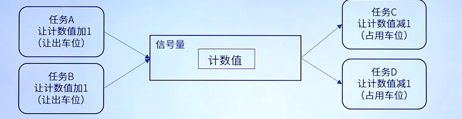
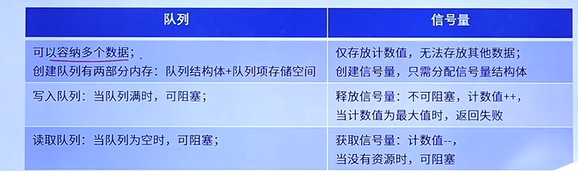
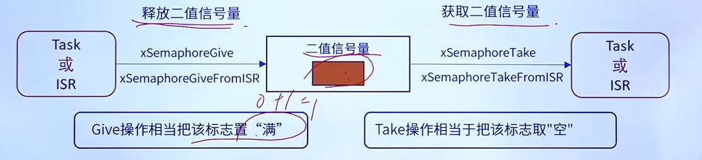
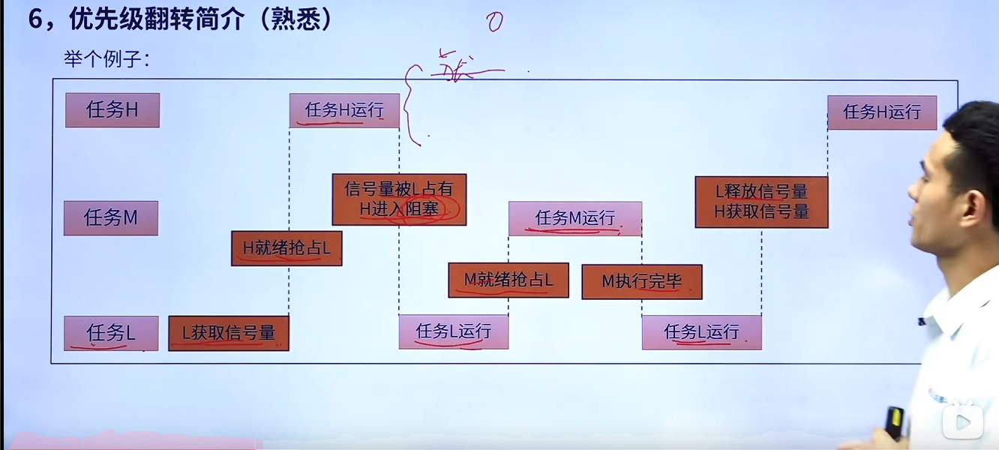
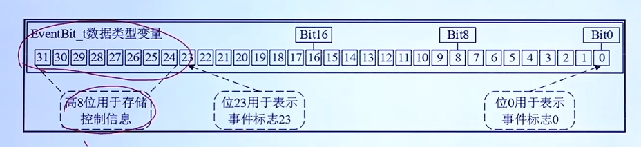
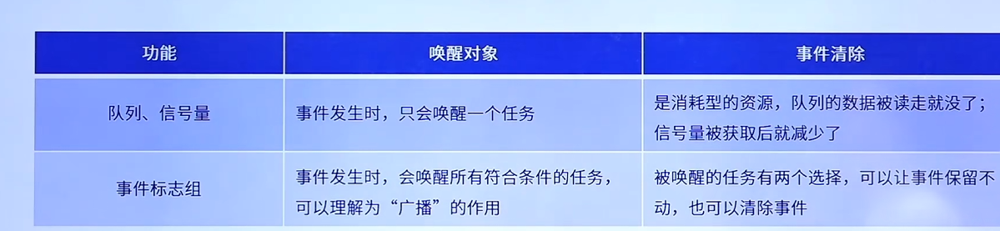

# FreeRTOS笔记

[TOC]

## 基础知识

## 任务

## 列表和列表项

## 队列

## 信号量
### 信号量的简介
* 信号量在FreeRTOS中用于**任务同步**与**资源保护**，可以实现对共享资源的访问。与队列相比，信号量表示一种状态（通过计数值表示），而非数据（其实信号量就是一种特殊的队列，这也是在学完队列之后才学信号量的原因，这一点在之后的API函数讲解也有体现）。

* 类似于停车场的车位，计数值可以类比与停车场的剩余车位，当还有剩余车位（计数值不为0，信号量有资源）时，任务可以获取信号量。而当没有剩余车位（信号量计数值为0，没有资源）时，任务可以选择等待信号量（阻塞状态），等待值有信号量被释放时，再获取信号量，也可以选择直接返回失败（非阻塞），不等待。  

* 任务获取信号量时，信号量计数值--，释放信号量时，计数值++。当计数值减到0时，表示无资源，其他任务无法获取（可阻塞）。而当任务释放信号量，发现信号量达到最大值时，直接返回失败（无法释放），因为此时任务实际上就没有获取到信号量。  

如下图
 

与队列的不同  

 


* 信号量的计数值存在最大值，由最大值的数值不同，可以将信号量的类型分为两种：**二值信号量**（最大值为1），**计数型信号量**（最大值大于1）。

* 那么信号量的计数值是什么呢？为何说信号量与队列的不同是信号量传递的是**状态**，而队列传递的是数据呢。等待被读取数据的队列项的数目其实就是信号量的计数值，而队列主要关注的是每一个队列项内部的数据，这也是为什么队列有两个内存空间，需要存储**队列结构体**与**队列项内部的数据**这两部分，与前面的对比和队列知识的讲解不谋而合。


接下来是对这两种信号量的知识总结。
### 二值信号量
#### 基本知识
> 二值信号量本质是一个队列长度为1的队列，只有空和满两种状态。
> 
> 二值信号量通常用于互斥访问和任务同步，与互斥信号量类似，但二值信号量可能会发生**优先级翻转**的问题，所以二值信号量更适合用于同步
 
* 二值信号量用于任务间同步时，存在以下场景：例如，有A、B两个任务，任务A等待某个时间发生，任务B在事件发生后释放二值信号量，任务A获取二值信号量，获取成功后继续执行任务，实现了两个任务间的通信与同步。

图例如下：
 

* 使用二值信号量的过程：

1. 创建二值信号量
2. 释放二值信号量
3. 获取二值信号量

* 为何先释放再获取：创建二值信号量时，初始化队列的待获取数据的队列项为0，此时二值信号量为0，需要先释放，使其为1。若初始化队列项数为1，则可能出现高优先级任务直接获取到信号量并执行任务，这是我们不愿意看到的。

#### 二值信号量的API函数

##### xSemaphoreCreateBinary()

```c
#if( configSUPPORT_DYNAMIC_ALLOCATION == 1 )
	#define xSemaphoreCreateBinary() xQueueGenericCreate( ( UBaseType_t ) 1, semSEMAPHORE_QUEUE_ITEM_LENGTH, queueQUEUE_TYPE_BINARY_SEMAPHORE )
#endif
```
* 二值信号量动态创建，实际上是对`xQueueGenericCreate()`函数的宏定义，此函数为队列动态创建函数，具体函数细节请见[队列章节](#队列)。
* 被宏定义入口参数有`const UBaseType_t uxQueueLength`  `const UBaseType_tuxItemSize` `const uint8_t ucQueueType`
* 创建二值信号量时`uxQueueLength`队列长度为1，即最大计数值为1。`uxItemSize`的值为`semSEMAPHORE_QUEUE_ITEM_LENGTH`此值宏定义为0，即队列项的数目为0，这就是信号量的计数值，初始化为空的状态，在后面的信号量获取和信号量释放函数都要对这个值进行判断。
* 最后的`ucQueueType`队列类型为宏定义的`queueQUEUE_TYPE_BINARY_SEMAPHORE`表示二值信号量。
* 返回值为队列句柄，用于释放获取信号量

##### xSemaphoreCreateBinaryStatic()

```c
#if( configSUPPORT_STATIC_ALLOCATION == 1 )
	#define xSemaphoreCreateBinaryStatic( pxStaticSemaphore ) xQueueGenericCreateStatic( ( UBaseType_t ) 1, semSEMAPHORE_QUEUE_ITEM_LENGTH, NULL, pxStaticSemaphore, queueQUEUE_TYPE_BINARY_SEMAPHORE )
#endif /* configSUPPORT_STATIC_ALLOCATION */
```
* 二值信号量的静态创建，是对`xQueueGenericCreateStatic()`静态队列创建的宏定义，具体函数细节请见[队列章节](#队列)。
* 其中入参`uxQueueLength`  `uxItemSize` `ucQueueType`与动态创建相同，静态创建比其多出的是`uint8_t *pucQueueStorage`, `StaticQueue_t *pxStaticQueue`这两个参量，因为是静态创建，所以需要用户自定义队列与分配内存，详情请见[任务章节](#任务)
* 返回值为队列句柄，用于释放获取信号量

##### xSemaphoreGive()


```c
#define xSemaphoreGive( xSemaphore )		xQueueGenericSend( ( QueueHandle_t ) ( xSemaphore ), NULL, semGIVE_BLOCK_TIME, queueSEND_TO_BACK )
```
* 释放信号量函数，入参为生成信号量句柄，是入队函数的宏定义。
* `xSemaphore`要释放的信号量句柄
* 因为信号量不需要队列项内有数据，所以第二个参数（数据的源地址）为`NULL`。
* `semGIVE_BLOCK_TIME`是释放信号量的等待时间，所以实际上的值为0（不阻塞，队列满了直接返回失败）。
* `queueSEND_TO_BACK`是队列项的插入位置，为队列项的尾部。
* 返回值：  
    * `pdPASS`：数据成功发送到队列，释放信号量成功。
    * `errQUEUE_FULL`：队列满且超时（但设置的阻塞时间为0所以不存在超时，队列满就直接返回错误），发送失败。
* `#define semGIVE_BLOCK_TIME					( ( TickType_t ) 0U )`


##### xSemaphoreGiveFromISR()

```c
#define xSemaphoreGiveFromISR( xSemaphore, pxHigherPriorityTaskWoken )	xQueueGiveFromISR( ( QueueHandle_t ) ( xSemaphore ), ( pxHigherPriorityTaskWoken ) )
```
* 中断中调用的释放信号量函数


##### xSemaphoreTake()

```c
#define xSemaphoreTake( xSemaphore, xBlockTime )		xQueueSemaphoreTake( ( xSemaphore ), ( xBlockTime ) )
```

* 获取信号量函数，是对`xQueueSemaphoreTake()`函数的宏定义，表示从队列获取数据，内部具体逻辑请见[队列](#队列)。
* `xSemaphore`:获取信号量的句柄
* `xBlockTime`:设置的阻塞时间
* 如果要设置一直等待（死等），直到有信号量被释放，需要将`xBlockTime`设置为`portMAX_DELAY`
* `#define portMAX_DELAY ( TickType_t ) 0xffffffffUL`最大等待时间


* 返回值：
    * `pdTRUE`:获取信号量成功
    * `pdFALSE`:超时，获取信号量失败

##### xSemaphoreTakeFromISR()

```c
#define xSemaphoreTakeFromISR( xSemaphore, pxHigherPriorityTaskWoken )	xQueueReceiveFromISR( ( QueueHandle_t ) ( xSemaphore ), NULL, ( pxHigherPriorityTaskWoken ) )

```
* 中断中调用的获取信号量函数


### 计数型信号量

#### 基本知识
> 计数型信号量相当于队列长度大于1的队列，因此计数型信号量能容纳多个资源，这是计数型信号量在创建时被确定的。

* 计数型信号量的适用场合：
    * **事件计数**：当每次事件发生后，在事件处理函数中释放计数型信号量(计数值+1)，其他任务会获取计数型信号量(计数值-1)，这种场合一般在创建时将初始计数值设置为 0（生产者消费者模型）
    * **资源管理**：信号量表示有效的资源数目。任务必须先获取信号量(信号量计数值-1)才能获取资源控制权。当计数值减为零时表示没有的资源。当任务使用完资源后，必须释放信号量(信号量计数值+1)。信号量创建时计数值应等于最大资源数目

#### 计数型信号量的API函数

* 这里说明计数型API函数的[信号量释放函数](#xsemaphoregivexsemaphore)和[信号量获取函数](#xsemaphoretake-xsemaphore-xblocktime-)与二值信号量完全相同，下面不再列举。

##### xSemaphoreCreateCounting()

```c
	#define xSemaphoreCreateCounting( uxMaxCount, uxInitialCount ) xQueueCreateCountingSemaphore( ( uxMaxCount ), ( uxInitialCount ) )
```

* 计数型信号量的动态创建函数是对`xQueueCreateCountingSemaphore()`的宏定义。
* `uxMaxCount`是设置的最大资源量（最大计数值）
* `uxInitialCount`是设置的初始资源量（初始计数值）
* 返回值：
    * `NULL`：创建失败
    * 其他值：返回创建信号量的句柄。

下面是`xQueueCreateCountingSemaphore()`的具体实现逻辑

```c
    QueueHandle_t xQueueCreateCountingSemaphore( const UBaseType_t uxMaxCount, const UBaseType_t uxInitialCount )
	{
	QueueHandle_t xHandle;

		configASSERT( uxMaxCount != 0 );
		configASSERT( uxInitialCount <= uxMaxCount );

		xHandle = xQueueGenericCreate( uxMaxCount, queueSEMAPHORE_QUEUE_ITEM_LENGTH, queueQUEUE_TYPE_COUNTING_SEMAPHORE );//创建一个普通的队列（这里使用了uxMaxCount）

		if( xHandle != NULL )
		{
			( ( Queue_t * ) xHandle )->uxMessagesWaiting = uxInitialCount;//使用uxInitialCount给信号量的初始待收队列项个数赋值，这个就是计数值的初始值

			traceCREATE_COUNTING_SEMAPHORE();
		}
		else
		{
			traceCREATE_COUNTING_SEMAPHORE_FAILED();
		}

		return xHandle;//返回计数型信号量句柄
	}
```

##### xSemaphoreCreateCountingStatic()

```c
	#define xSemaphoreCreateCountingStatic( uxMaxCount, uxInitialCount, pxSemaphoreBuffer ) xQueueCreateCountingSemaphoreStatic( ( uxMaxCount ), ( uxInitialCount ), ( pxSemaphoreBuffer ) )

```

* 这是计数型信号量的静态创建方式，也就是需要用户自行分配内存。
* `uxMaxCount`是设置的最大资源量（最大计数值）
* `uxInitialCount`是设置的初始资源量（初始计数值）
* `pxSemaphoreBuffer`用户自行分配的内存地址
* 返回值：
    * `NULL`：创建失败
    * 其他值：返回创建信号量的句柄。

下面是`xQueueCreateCountingSemaphoreStatic()`的具体实现逻辑

```c
	QueueHandle_t xQueueCreateCountingSemaphoreStatic( const UBaseType_t uxMaxCount, const UBaseType_t uxInitialCount, StaticQueue_t *pxStaticQueue )
	{
	    QueueHandle_t xHandle;

		configASSERT( uxMaxCount != 0 );
		configASSERT( uxInitialCount <= uxMaxCount );

		xHandle = xQueueGenericCreateStatic( uxMaxCount, queueSEMAPHORE_QUEUE_ITEM_LENGTH, NULL, pxStaticQueue, queueQUEUE_TYPE_COUNTING_SEMAPHORE );

		if( xHandle != NULL )
		{
			( ( Queue_t * ) xHandle )->uxMessagesWaiting = uxInitialCount;

			traceCREATE_COUNTING_SEMAPHORE();
		}
		else
		{
			traceCREATE_COUNTING_SEMAPHORE_FAILED();
		}

		return xHandle;
	}

```

##### uxSemaphoreGetCount()

```c
#define uxSemaphoreGetCount( xSemaphore ) uxQueueMessagesWaiting( ( QueueHandle_t ) ( xSemaphore ) )

```

* 获取当前信号量计数值函数，是对`uxQueueMessagesWaiting()`函数的宏定义，
此函数的作用是获取队列待获取的队列项数目，具体函数逻辑请见[队列章节](#队列)
* `xSemaphore`希望获取计数值的信号量句柄
* 返回值：`int`类型，表示当前信号量的大小

### 优先级翻转

>  前面在讲[二值信号量](#二值信号量)时提到了，使用二值信号量时会出现优先级翻转的问题，这里就具体展开为何和在什么情况下会发生这种问题。

* 信号量翻转：高优先级的任务反而执行慢，低优先级的任务反而优先执行。
* 优先级翻转在抢占式内核中是非常常见的，但是在实时操作系统中是不允许出现优先级翻转的，因为优先级翻转会破坏任务的预期顺序，可能会导致未知的严重后果。

下面一个具体的任务进程进行解释：


* 如图，假设有三个任务L、M、H,分别表示优先级低、中、高三个任务。
* 任务L的内容是先获取信号量，然后执行一段时间的任务（假设是`delayms(3000)`）之后再释放信号量
* 任务M的内容是打印一段文字（时间较短）
* 任务H的内容先获取信号量，然后执行一段时间的任务（假设是`delayms(1000)时间比任务L要短`）之后再释放信号量。
* 假设一开始任务L先进入就绪态，而H和M在阻塞态，此时L执行获取信号量。
* 后面任务H退出阻塞态进入就绪态，由于优先级高会抢占任务L的任务，开始执行获取信号量，由于前面任务L已经获取，此时由于是二值信号量（此时无资源），任务H无法获取，任务H进入阻塞态，任务L再进行一段任务。
* 再之后，由于任务M进入就绪态，会抢占任务L，执行完任务M后，任务L继续执行，执行到释放信号量
* 由于此时信号量有资源，任务H直接抢占获取，执行任务H成功

> 综上，可以发现此时任务M反而先执行，而更高优先级的任务H后执行，这是二值信号量的弊端，我们更倾向于将二值信号量用于任务同步，而非互斥访问。


> 若要实现互斥访问，并解决上面的例子的问题，则需要下面的互斥量，相信看完你就知道如何解决优先级翻转的问题了（真是天才的设计）


### 互斥量

#### 基本知识
* **互斥信号量**其实就是一个拥有优先级继承的**二值信号量**，在同步的应用中二值信号量最适合。互斥信号量适合用于那些需要互斥访问的应用中!
* 优先级继承：当一个互斥信号量正在被一个低优先级的任务持有时，如果此时这个高优先级的任务正在尝试获取这个互斥信号量，那么这个高优先级的任务就会被阻塞。不过这个高优先级的任务会将这个低优先级的任务的优先级提升到与自己相同的优先级。（尽快使信号量被释放，使得高优先级的任务尽快获得信号量）
如下图：


* 此时若将任务L的优先级提升到任务H的优先级，就可以防止其被任务M阻塞（优先级翻转），任务L就会尽快执行，并释放信号量，此时任务H就可以获取信号量。
* 所以优先级继承并不能完全的消除优先级翻转的问题，它只是尽可能的降低优先级翻转带来的影响
* 注意:互斥信号量不能用于中断服务函数中，原因如下:
    * 互斥信号量有任务优先级继承的机制，但是中断不是任务，没有任务优先级，所以互斥信号量用与任务中，不能用于中断服务函数。
    * 中断服务函数中不能因为要等待互斥信号量而设置阻塞时间进入阻塞态。
    * 因此使用互斥信号量也用不到获取释放函数的中断形式。
* 使用互斥量的过程：
    * 首先将宏`configUSE_MUTEXES`置1,表示要使用互斥量
    * 创建互斥量
    * （take）获取信号量
    * （give）释放信号量//***这里与上面信号量的创建后的使用顺序不同，是因为互斥量的创建函数中自动向队列内发送了一个信号量（自动释放了），所以不用提前释放了***//
  
#### 互斥量的API函数
* 下面主要介绍互斥量的创建函数，因为互斥量的释放获取函数与上述信号量完全相同（包括使用方法），只不过互斥量无法再中断中使用。

##### xSemaphoreCreateMutex()
```c
	#define xSemaphoreCreateMutex() xQueueCreateMutex( queueQUEUE_TYPE_MUTEX )
```
* 互斥量创建函数（动态）
* 返回值：
    * `NULL`：创建失败
    * 其他值：返回创建互斥量的句柄。

***

```c
	QueueHandle_t xQueueCreateMutex( const uint8_t ucQueueType )
	{
	QueueHandle_t xNewQueue;
	const UBaseType_t uxMutexLength = ( UBaseType_t ) 1, uxMutexSize = ( UBaseType_t ) 0;

		xNewQueue = xQueueGenericCreate( uxMutexLength, uxMutexSize, ucQueueType );
		prvInitialiseMutex( ( Queue_t * ) xNewQueue );

		return xNewQueue;
	}
```
* 这是被宏定义的函数内部，创建了一个队列
***
```c
	static void prvInitialiseMutex( Queue_t *pxNewQueue )
	{
		if( pxNewQueue != NULL )
		{
			/* The queue create function will set all the queue structure members
			correctly for a generic queue, but this function is creating a
			mutex.  Overwrite those members that need to be set differently -
			in particular the information required for priority inheritance. */
			pxNewQueue->u.xSemaphore.xMutexHolder = NULL;
			pxNewQueue->uxQueueType = queueQUEUE_IS_MUTEX;

			/* In case this is a recursive mutex. */
			pxNewQueue->u.xSemaphore.uxRecursiveCallCount = 0;

			traceCREATE_MUTEX( pxNewQueue );

			/* Start with the semaphore in the expected state. */
			( void ) xQueueGenericSend( pxNewQueue, NULL, ( TickType_t ) 0U, queueSEND_TO_BACK );
		}
		else
		{
			traceCREATE_MUTEX_FAILED();
		}
	}
```
* 这是创建互斥量函数内部的初始化互斥量函数
* 发现`( void ) xQueueGenericSend( pxNewQueue, NULL, ( TickType_t ) 0U, queueSEND_TO_BACK );`这一句已经自动释放信号量了。


##### xSemaphoreCreateMutexStatic()
```c

	#define xSemaphoreCreateMutexStatic( pxMutexBuffer ) xQueueCreateMutexStatic( queueQUEUE_TYPE_MUTEX, ( pxMutexBuffer ) )
```
* 互斥量创建函数（静态态）
* 返回值：
    * `NULL`：创建失败
    * 其他值：返回创建互斥量的句柄。


## 队列集

### 基础知识
>假设有这么个情况：现在有一个任务的while函数中同时需要接收队列信息和获取信号量，但此时如果队列没有信息进入，则会一直阻塞（若死等），那么此时信号量被释放，这个任务也无法获取信号量了，总不能忘了葡萄又丢了西瓜。


> 此时就可以使用队列集将两个队列放在一个队列集里面
* 一个队列只允许任务间传递的消息为同一种数据类型，如果需要在任务间传递不同数据类型的消息时,那么就可以使用队列集!
* 作用:用于对多个队列或信号量进行“监听”，其中不管哪一个消息到来，都可让任务退出阻塞。（这个后面的函数会提到，相当于先听到信息，再分辨是哪里来的信息（哪个队列））。

#### 队列集的API函数

##### xQueueCreateSet()

```c
	QueueSetHandle_t xQueueCreateSet( const UBaseType_t uxEventQueueLength )
	{
	QueueSetHandle_t pxQueue;

		pxQueue = xQueueGenericCreate( uxEventQueueLength, ( UBaseType_t ) sizeof( Queue_t * ), queueQUEUE_TYPE_SET );

		return pxQueue;
	}
```

* 队列集创建函数
* `uxEventQueueLength`队列集可容纳的队列数量
* 返回值：
    * `NULL`：创建失败
    * 其他值：队列集创建成功，返回队列集的句柄。

##### xQueueAddToSet()
```c
	BaseType_t xQueueAddToSet( QueueSetMemberHandle_t xQueueOrSemaphore, QueueSetHandle_t xQueueSet )
	{
	BaseType_t xReturn;

		taskENTER_CRITICAL();
		{
			if( ( ( Queue_t * ) xQueueOrSemaphore )->pxQueueSetContainer != NULL )
			{
				/* Cannot add a queue/semaphore to more than one queue set. */
				xReturn = pdFAIL;
			}
			else if( ( ( Queue_t * ) xQueueOrSemaphore )->uxMessagesWaiting != ( UBaseType_t ) 0 )
			{
				/* Cannot add a queue/semaphore to a queue set if there are already
				items in the queue/semaphore. */
				xReturn = pdFAIL;
			}
			else
			{
				( ( Queue_t * ) xQueueOrSemaphore )->pxQueueSetContainer = xQueueSet;
				xReturn = pdPASS;
			}
		}
		taskEXIT_CRITICAL();

		return xReturn;
	}
```
* 此函数用于队列添加到队列集，但要注意队列被添加到队列集之前，队列内部不能有有效数据（内部为空）。
* `xQueueOrSemaphore`想要添加的队列的句柄
* `xQueueSet`想要添加进的队列集的句柄
* 返回值：
	* pdPASS：队列集添加成功
	* pdFAIL：队列集添加失败


##### xQueueRemoveFromSet()

```c
	BaseType_t xQueueRemoveFromSet( QueueSetMemberHandle_t xQueueOrSemaphore, QueueSetHandle_t xQueueSet )
	{
	BaseType_t xReturn;
	Queue_t * const pxQueueOrSemaphore = ( Queue_t * ) xQueueOrSemaphore;

		if( pxQueueOrSemaphore->pxQueueSetContainer != xQueueSet )
		{
			/* The queue was not a member of the set. */
			xReturn = pdFAIL;
		}
		else if( pxQueueOrSemaphore->uxMessagesWaiting != ( UBaseType_t ) 0 )
		{
			/* It is dangerous to remove a queue from a set when the queue is
			not empty because the queue set will still hold pending events for
			the queue. */
			xReturn = pdFAIL;
		}
		else
		{
			taskENTER_CRITICAL();
			{
				/* The queue is no longer contained in the set. */
				pxQueueOrSemaphore->pxQueueSetContainer = NULL;
			}
			taskEXIT_CRITICAL();
			xReturn = pdPASS;
		}

		return xReturn;
	} /*lint !e818 xQueueSet could not be declared as pointing to const as it is a typedef. */

```

* 此函数用于从队列集中移除函数，但是注意（与上面的函数类似）被移除前，队列内不能有任何有效信息
* `xQueueOrSemaphore`想要移除的队列的句柄
* `xQueueSet`想要移除出的队列集的句柄
* 返回值：
	* pdPASS：队列集移除成功
	* pdFAIL：队列集移除失败


##### xQueueSelectFromSet()

```c
		QueueSetMemberHandle_t xQueueSelectFromSet( QueueSetHandle_t xQueueSet, TickType_t const xTicksToWait )
	{
	QueueSetMemberHandle_t xReturn = NULL;

		( void ) xQueueReceive( ( QueueHandle_t ) xQueueSet, &xReturn, xTicksToWait ); /*lint !e961 Casting from one typedef to another is not redundant. */
		return xReturn;
	}
```

* 此函数用于获取在队列集中有效信息的队列
* `xQueueSet`目标队列集句柄
* `xTicksToWait`获取等待时间（最大可以死等）
* `xReturn`返回队列集中有有效信息的队列的句柄

> 其实经过这几个函数的分析发现，队列集其实就是将某个队列或信号量的结构体指向了队列集，队列集通过指针跟踪这些队列或信号量
>


## 事件标志组
### 基本知识
#### 事件标志位
* 事件标志位：用一位来表示事件是否发生
#### 事件标志组
* 事件标志组就是一组事件标志位的集合（类似有一个uint32类型的每一位），可以简单理解事件标志组就是一个整数。
* 事件标志组的特点：
	1. 他的每一位都表示了一个事件（高8位不算）
	2. 每一位事件的函数都由用户自己决定，如：bit0表示按键按下，那么bit0为1就是按键按下（事件发生了）；值为0就是按键未按下（事件未发生）
	3. 任何任务或中断都可以读写这些位（写1或写0）
	4. 可以等待某一位成立，或者多位同时成立（后面有api函数可以实现）。
* 一个事件组就包含了一个c数据类型的变量，变量`EventBits_t`的定义如下所示。

```c
typedef TickType_t EventBits_t;

#if( configUSE_16_BIT_TICKS == 1 )//16位
	typedef uint16_t TickType_t;
	#define portMAX_DELAY ( TickType_t ) 0xffff
#else
	typedef uint32_t TickType_t;//32位
	#define portMAX_DELAY ( TickType_t ) 0xffffffffUL

	/* 32-bit tick type on a 32-bit architecture, so reads of the tick count do
	not need to be guarded with a critical section. */
	#define portTICK_TYPE_IS_ATOMIC 1
#endif

```

* `EventBits_t`实际上就是一个16位或32位的数据类型

* 虽然使用的32位无符号的数据变量类型来储存事件标志，但其中高8位作为储存事件标志组的控制信息，低24位用于储存事件标志位，
* 所以一个事件标志组最多可以储存24个事件标志位。
如下图：


队列信号量与事件标志组的区别：


### 事件标志组的API函数

#### 事件标志组的句柄

```c
typedef struct EventGroupDef_t
{
	EventBits_t uxEventBits;
	List_t xTasksWaitingForBits;		/*< List of tasks waiting for a bit to be set. */

	#if( configUSE_TRACE_FACILITY == 1 )
		UBaseType_t uxEventGroupNumber;
	#endif

	#if( ( configSUPPORT_STATIC_ALLOCATION == 1 ) && ( configSUPPORT_DYNAMIC_ALLOCATION == 1 ) )
		uint8_t ucStaticallyAllocated; /*< Set to pdTRUE if the event group is statically allocated to ensure no attempt is made to free the memory. */
	#endif
} EventGroup_t;

```

* `uxEventBits`标志组的容量
* `xTasksWaitingForBits`当事件标志满足任务的等待条件时（如指定 bit 全部置位或至少一个置位），FreeRTOS 会从该列表中唤醒相应任务。
#### xEventGroupCreate()

```c
	EventGroupHandle_t xEventGroupCreate( void )
	{
	EventGroup_t *pxEventBits;

		pxEventBits = ( EventGroup_t * ) pvPortMalloc( sizeof( EventGroup_t ) ); /*lint !e9087 !e9079 see comment above. */

		if( pxEventBits != NULL )
		{
			pxEventBits->uxEventBits = 0;
			vListInitialise( &( pxEventBits->xTasksWaitingForBits ) );

			#if( configSUPPORT_STATIC_ALLOCATION == 1 )
			{
				/* Both static and dynamic allocation can be used, so note this
				event group was allocated statically in case the event group is
				later deleted. */
				pxEventBits->ucStaticallyAllocated = pdFALSE;
			}
			#endif /* configSUPPORT_STATIC_ALLOCATION */

			traceEVENT_GROUP_CREATE( pxEventBits );
		}
		else
		{
			traceEVENT_GROUP_CREATE_FAILED(); /*lint !e9063 Else branch only exists to allow tracing and does not generate code if trace macros are not defined. */
		}

		return pxEventBits;
	}


```

* 事件组创建的动态方式
* 返回值：
	* `NULL`创建失败
	* 创建成功返回事件组的句柄
	
#### xEventGroupCreateStatic()

```c
	EventGroupHandle_t xEventGroupCreateStatic( StaticEventGroup_t *pxEventGroupBuffer )
	{
	EventGroup_t *pxEventBits;

		/* A StaticEventGroup_t object must be provided. */
		configASSERT( pxEventGroupBuffer );

		#if( configASSERT_DEFINED == 1 )
		{
			/* Sanity check that the size of the structure used to declare a
			variable of type StaticEventGroup_t equals the size of the real
			event group structure. */
			volatile size_t xSize = sizeof( StaticEventGroup_t );
			configASSERT( xSize == sizeof( EventGroup_t ) );
		} /*lint !e529 xSize is referenced if configASSERT() is defined. */
		#endif /* configASSERT_DEFINED */

		/* The user has provided a statically allocated event group - use it. */
		pxEventBits = ( EventGroup_t * ) pxEventGroupBuffer; /*lint !e740 !e9087 EventGroup_t and StaticEventGroup_t are deliberately aliased for data hiding purposes and guaranteed to have the same size and alignment requirement - checked by configASSERT(). */

		if( pxEventBits != NULL )
		{
			pxEventBits->uxEventBits = 0;
			vListInitialise( &( pxEventBits->xTasksWaitingForBits ) );

			#if( configSUPPORT_DYNAMIC_ALLOCATION == 1 )
			{
				/* Both static and dynamic allocation can be used, so note that
				this event group was created statically in case the event group
				is later deleted. */
				pxEventBits->ucStaticallyAllocated = pdTRUE;
			}
			#endif /* configSUPPORT_DYNAMIC_ALLOCATION */

			traceEVENT_GROUP_CREATE( pxEventBits );
		}
		else
		{
			/* xEventGroupCreateStatic should only ever be called with
			pxEventGroupBuffer pointing to a pre-allocated (compile time
			allocated) StaticEventGroup_t variable. */
			traceEVENT_GROUP_CREATE_FAILED();
		}

		return pxEventBits;
	}
```

* * 事件组创建的静态方式
* 返回值：
	* `NULL`创建失败
	* 创建成功返回事件组的句柄

#### xEventGroupSync()


```c
EventBits_t xEventGroupSync( EventGroupHandle_t xEventGroup, const EventBits_t uxBitsToSet, const EventBits_t uxBitsToWaitFor, TickType_t xTicksToWait )
{
EventBits_t uxOriginalBitValue, uxReturn;
EventGroup_t *pxEventBits = xEventGroup;
BaseType_t xAlreadyYielded;
BaseType_t xTimeoutOccurred = pdFALSE;

	configASSERT( ( uxBitsToWaitFor & eventEVENT_BITS_CONTROL_BYTES ) == 0 );
	configASSERT( uxBitsToWaitFor != 0 );
	#if ( ( INCLUDE_xTaskGetSchedulerState == 1 ) || ( configUSE_TIMERS == 1 ) )
	{
		configASSERT( !( ( xTaskGetSchedulerState() == taskSCHEDULER_SUSPENDED ) && ( xTicksToWait != 0 ) ) );
	}
	#endif

	vTaskSuspendAll();
	{
		uxOriginalBitValue = pxEventBits->uxEventBits;

		( void ) xEventGroupSetBits( xEventGroup, uxBitsToSet );

		if( ( ( uxOriginalBitValue | uxBitsToSet ) & uxBitsToWaitFor ) == uxBitsToWaitFor )
		{
			/* All the rendezvous bits are now set - no need to block. */
			uxReturn = ( uxOriginalBitValue | uxBitsToSet );

			/* Rendezvous always clear the bits.  They will have been cleared
			already unless this is the only task in the rendezvous. */
			pxEventBits->uxEventBits &= ~uxBitsToWaitFor;

			xTicksToWait = 0;
		}
		else
		{
			if( xTicksToWait != ( TickType_t ) 0 )
			{
				traceEVENT_GROUP_SYNC_BLOCK( xEventGroup, uxBitsToSet, uxBitsToWaitFor );

				/* Store the bits that the calling task is waiting for in the
				task's event list item so the kernel knows when a match is
				found.  Then enter the blocked state. */
				vTaskPlaceOnUnorderedEventList( &( pxEventBits->xTasksWaitingForBits ), ( uxBitsToWaitFor | eventCLEAR_EVENTS_ON_EXIT_BIT | eventWAIT_FOR_ALL_BITS ), xTicksToWait );

				/* This assignment is obsolete as uxReturn will get set after
				the task unblocks, but some compilers mistakenly generate a
				warning about uxReturn being returned without being set if the
				assignment is omitted. */
				uxReturn = 0;
			}
			else
			{
				/* The rendezvous bits were not set, but no block time was
				specified - just return the current event bit value. */
				uxReturn = pxEventBits->uxEventBits;
				xTimeoutOccurred = pdTRUE;
			}
		}
	}
	xAlreadyYielded = xTaskResumeAll();

	if( xTicksToWait != ( TickType_t ) 0 )
	{
		if( xAlreadyYielded == pdFALSE )
		{
			portYIELD_WITHIN_API();
		}
		else
		{
			mtCOVERAGE_TEST_MARKER();
		}

		/* The task blocked to wait for its required bits to be set - at this
		point either the required bits were set or the block time expired.  If
		the required bits were set they will have been stored in the task's
		event list item, and they should now be retrieved then cleared. */
		uxReturn = uxTaskResetEventItemValue();

		if( ( uxReturn & eventUNBLOCKED_DUE_TO_BIT_SET ) == ( EventBits_t ) 0 )
		{
			/* The task timed out, just return the current event bit value. */
			taskENTER_CRITICAL();
			{
				uxReturn = pxEventBits->uxEventBits;

				/* Although the task got here because it timed out before the
				bits it was waiting for were set, it is possible that since it
				unblocked another task has set the bits.  If this is the case
				then it needs to clear the bits before exiting. */
				if( ( uxReturn & uxBitsToWaitFor ) == uxBitsToWaitFor )
				{
					pxEventBits->uxEventBits &= ~uxBitsToWaitFor;
				}
				else
				{
					mtCOVERAGE_TEST_MARKER();
				}
			}
			taskEXIT_CRITICAL();

			xTimeoutOccurred = pdTRUE;
		}
		else
		{
			/* The task unblocked because the bits were set. */
		}

		/* Control bits might be set as the task had blocked should not be
		returned. */
		uxReturn &= ~eventEVENT_BITS_CONTROL_BYTES;
	}

	traceEVENT_GROUP_SYNC_END( xEventGroup, uxBitsToSet, uxBitsToWaitFor, xTimeoutOccurred );

	/* Prevent compiler warnings when trace macros are not used. */
	( void ) xTimeoutOccurred;

	return uxReturn;
}
```
* 此函数用于多任务同步
* `xEventGroup`事件组句柄
* `uxBitsToSet`要设置的标志位（表示本任务已就绪）
* `uxBitsToWaitFor`需要等待的所有标志位（所有任务都就绪） 
* `xTicksToWait`超时时间（0表示不等待，`portMAX_DELAY`表示无限等待）
* 任务调用 xEventGroupSync() 时，首先将 uxBitsToSet 对应的标志位置位（原子操作）。
* 然后检查 uxBitsToWaitFor 中的所有标志位是否都已置位：
	* 若已全部置位：清除这些标志位（默认行为），函数返回当前标志位状态，任务继续执行。
	* 若未全部置位：任务进入阻塞态，加入事件标志组的等待列表，等待其他任务设置剩余标志位。
* 当最后一个任务设置标志位后，所有等待的任务会被同时唤醒，标志位被清除，任务继续执行。
* 这里举一个例子：就像task1是做饭，task2是做菜，此时task1调用此函数，表示做完返利，然后等待task2将做菜标志位置1，等待完成后，进行下面的任务吃饭。

#### xEventGroupSetBits()

```c
EventBits_t xEventGroupSetBits( EventGroupHandle_t xEventGroup, const EventBits_t uxBitsToSet )
{
ListItem_t *pxListItem, *pxNext;
ListItem_t const *pxListEnd;
List_t const * pxList;
EventBits_t uxBitsToClear = 0, uxBitsWaitedFor, uxControlBits;
EventGroup_t *pxEventBits = xEventGroup;
BaseType_t xMatchFound = pdFALSE;

	configASSERT( xEventGroup );
	configASSERT( ( uxBitsToSet & eventEVENT_BITS_CONTROL_BYTES ) == 0 );

	pxList = &( pxEventBits->xTasksWaitingForBits );
	pxListEnd = listGET_END_MARKER( pxList ); 
	vTaskSuspendAll();
	{
		traceEVENT_GROUP_SET_BITS( xEventGroup, uxBitsToSet );

		pxListItem = listGET_HEAD_ENTRY( pxList );

		/* Set the bits. */
		pxEventBits->uxEventBits |= uxBitsToSet;

		/* See if the new bit value should unblock any tasks. */
		while( pxListItem != pxListEnd )
		{
			pxNext = listGET_NEXT( pxListItem );
			uxBitsWaitedFor = listGET_LIST_ITEM_VALUE( pxListItem );
			xMatchFound = pdFALSE;

			/* Split the bits waited for from the control bits. */
			uxControlBits = uxBitsWaitedFor & eventEVENT_BITS_CONTROL_BYTES;
			uxBitsWaitedFor &= ~eventEVENT_BITS_CONTROL_BYTES;

			if( ( uxControlBits & eventWAIT_FOR_ALL_BITS ) == ( EventBits_t ) 0 )
			{
				/* Just looking for single bit being set. */
				if( ( uxBitsWaitedFor & pxEventBits->uxEventBits ) != ( EventBits_t ) 0 )
				{
					xMatchFound = pdTRUE;
				}
				else
				{
					mtCOVERAGE_TEST_MARKER();
				}
			}
			else if( ( uxBitsWaitedFor & pxEventBits->uxEventBits ) == uxBitsWaitedFor )
			{
				/* All bits are set. */
				xMatchFound = pdTRUE;
			}
			else
			{
				/* Need all bits to be set, but not all the bits were set. */
			}

			if( xMatchFound != pdFALSE )
			{
				/* The bits match.  Should the bits be cleared on exit? */
				if( ( uxControlBits & eventCLEAR_EVENTS_ON_EXIT_BIT ) != ( EventBits_t ) 0 )
				{
					uxBitsToClear |= uxBitsWaitedFor;
				}
				else
				{
					mtCOVERAGE_TEST_MARKER();
				}

				/* Store the actual event flag value in the task's event list
				item before removing the task from the event list.  The
				eventUNBLOCKED_DUE_TO_BIT_SET bit is set so the task knows
				that is was unblocked due to its required bits matching, rather
				than because it timed out. */
				vTaskRemoveFromUnorderedEventList( pxListItem, pxEventBits->uxEventBits | eventUNBLOCKED_DUE_TO_BIT_SET );
			}

			/* Move onto the next list item.  Note pxListItem->pxNext is not
			used here as the list item may have been removed from the event list
			and inserted into the ready/pending reading list. */
			pxListItem = pxNext;
		}

		/* Clear any bits that matched when the eventCLEAR_EVENTS_ON_EXIT_BIT
		bit was set in the control word. */
		pxEventBits->uxEventBits &= ~uxBitsToClear;
	}
	( void ) xTaskResumeAll();

	return pxEventBits->uxEventBits;
}


```

* 此函数用于设置标志位为1
* `xEventGroup`待操作的事件标志组句柄
* `uxBitsToSet`待置1的事件标志位
* 返回值：`int`置1前的事件组标志位的值


#### xEventGroupClearBits()
```c
EventBits_t xEventGroupClearBits( EventGroupHandle_t xEventGroup, const EventBits_t uxBitsToClear )
{
EventGroup_t *pxEventBits = xEventGroup;
EventBits_t uxReturn;

	/* Check the user is not attempting to clear the bits used by the kernel
	itself. */
	configASSERT( xEventGroup );
	configASSERT( ( uxBitsToClear & eventEVENT_BITS_CONTROL_BYTES ) == 0 );

	taskENTER_CRITICAL();
	{
		traceEVENT_GROUP_CLEAR_BITS( xEventGroup, uxBitsToClear );

		/* The value returned is the event group value prior to the bits being
		cleared. */
		uxReturn = pxEventBits->uxEventBits;

		/* Clear the bits. */
		pxEventBits->uxEventBits &= ~uxBitsToClear;
	}
	taskEXIT_CRITICAL();

	return uxReturn;
}
```
* 此函数用于将标志位清零
* `xEventGroup`待操作的事件标志组句柄
* `uxBitsToSet`待清零的事件标志位
* 返回值：`int`清零前的事件组标志位的值


#### xEventGroupClearBitsFromISR()
```c
/*-----------------------------------------------------------*/
	BaseType_t xEventGroupClearBitsFromISR( EventGroupHandle_t xEventGroup, const EventBits_t uxBitsToClear )
	{
		BaseType_t xReturn;

		traceEVENT_GROUP_CLEAR_BITS_FROM_ISR( xEventGroup, uxBitsToClear );
		xReturn = xTimerPendFunctionCallFromISR( vEventGroupClearBitsCallback, ( void * ) xEventGroup, ( uint32_t ) uxBitsToClear, NULL ); /*lint !e9087 Can't avoid cast to void* as a generic callback function not specific to this use case. Callback casts back to original type so safe. */

		return xReturn;
	}


```
* 中断中使用的清零函数


#### xEventGroupGetBitsFromISR()
```c
/*-----------------------------------------------------------*/

EventBits_t xEventGroupGetBitsFromISR( EventGroupHandle_t xEventGroup )
{
UBaseType_t uxSavedInterruptStatus;
EventGroup_t const * const pxEventBits = xEventGroup;
EventBits_t uxReturn;

	uxSavedInterruptStatus = portSET_INTERRUPT_MASK_FROM_ISR();
	{
		uxReturn = pxEventBits->uxEventBits;
	}
	portCLEAR_INTERRUPT_MASK_FROM_ISR( uxSavedInterruptStatus );

	return uxReturn;
} 
```
* 在中断读取事件组的标志位

#### xEventGroupWaitBits()

```c
EventBits_t xEventGroupWaitBits( EventGroupHandle_t xEventGroup, const EventBits_t uxBitsToWaitFor, const BaseType_t xClearOnExit, const BaseType_t xWaitForAllBits, TickType_t xTicksToWait )
{
EventGroup_t *pxEventBits = xEventGroup;
EventBits_t uxReturn, uxControlBits = 0;
BaseType_t xWaitConditionMet, xAlreadyYielded;
BaseType_t xTimeoutOccurred = pdFALSE;

	/* Check the user is not attempting to wait on the bits used by the kernel
	itself, and that at least one bit is being requested. */
	configASSERT( xEventGroup );
	configASSERT( ( uxBitsToWaitFor & eventEVENT_BITS_CONTROL_BYTES ) == 0 );
	configASSERT( uxBitsToWaitFor != 0 );
	#if ( ( INCLUDE_xTaskGetSchedulerState == 1 ) || ( configUSE_TIMERS == 1 ) )
	{
		configASSERT( !( ( xTaskGetSchedulerState() == taskSCHEDULER_SUSPENDED ) && ( xTicksToWait != 0 ) ) );
	}
	#endif

	vTaskSuspendAll();
	{
		const EventBits_t uxCurrentEventBits = pxEventBits->uxEventBits;

		/* Check to see if the wait condition is already met or not. */
		xWaitConditionMet = prvTestWaitCondition( uxCurrentEventBits, uxBitsToWaitFor, xWaitForAllBits );

		if( xWaitConditionMet != pdFALSE )
		{
			/* The wait condition has already been met so there is no need to
			block. */
			uxReturn = uxCurrentEventBits;
			xTicksToWait = ( TickType_t ) 0;

			/* Clear the wait bits if requested to do so. */
			if( xClearOnExit != pdFALSE )
			{
				pxEventBits->uxEventBits &= ~uxBitsToWaitFor;
			}
			else
			{
				mtCOVERAGE_TEST_MARKER();
			}
		}
		else if( xTicksToWait == ( TickType_t ) 0 )
		{
			/* The wait condition has not been met, but no block time was
			specified, so just return the current value. */
			uxReturn = uxCurrentEventBits;
			xTimeoutOccurred = pdTRUE;
		}
		else
		{
			/* The task is going to block to wait for its required bits to be
			set.  uxControlBits are used to remember the specified behaviour of
			this call to xEventGroupWaitBits() - for use when the event bits
			unblock the task. */
			if( xClearOnExit != pdFALSE )
			{
				uxControlBits |= eventCLEAR_EVENTS_ON_EXIT_BIT;
			}
			else
			{
				mtCOVERAGE_TEST_MARKER();
			}

			if( xWaitForAllBits != pdFALSE )
			{
				uxControlBits |= eventWAIT_FOR_ALL_BITS;
			}
			else
			{
				mtCOVERAGE_TEST_MARKER();
			}

			/* Store the bits that the calling task is waiting for in the
			task's event list item so the kernel knows when a match is
			found.  Then enter the blocked state. */
			vTaskPlaceOnUnorderedEventList( &( pxEventBits->xTasksWaitingForBits ), ( uxBitsToWaitFor | uxControlBits ), xTicksToWait );

			/* This is obsolete as it will get set after the task unblocks, but
			some compilers mistakenly generate a warning about the variable
			being returned without being set if it is not done. */
			uxReturn = 0;

			traceEVENT_GROUP_WAIT_BITS_BLOCK( xEventGroup, uxBitsToWaitFor );
		}
	}
	xAlreadyYielded = xTaskResumeAll();

	if( xTicksToWait != ( TickType_t ) 0 )
	{
		if( xAlreadyYielded == pdFALSE )
		{
			portYIELD_WITHIN_API();
		}
		else
		{
			mtCOVERAGE_TEST_MARKER();
		}

		/* The task blocked to wait for its required bits to be set - at this
		point either the required bits were set or the block time expired.  If
		the required bits were set they will have been stored in the task's
		event list item, and they should now be retrieved then cleared. */
		uxReturn = uxTaskResetEventItemValue();

		if( ( uxReturn & eventUNBLOCKED_DUE_TO_BIT_SET ) == ( EventBits_t ) 0 )
		{
			taskENTER_CRITICAL();
			{
				/* The task timed out, just return the current event bit value. */
				uxReturn = pxEventBits->uxEventBits;

				/* It is possible that the event bits were updated between this
				task leaving the Blocked state and running again. */
				if( prvTestWaitCondition( uxReturn, uxBitsToWaitFor, xWaitForAllBits ) != pdFALSE )
				{
					if( xClearOnExit != pdFALSE )
					{
						pxEventBits->uxEventBits &= ~uxBitsToWaitFor;
					}
					else
					{
						mtCOVERAGE_TEST_MARKER();
					}
				}
				else
				{
					mtCOVERAGE_TEST_MARKER();
				}
				xTimeoutOccurred = pdTRUE;
			}
			taskEXIT_CRITICAL();
		}
		else
		{
			/* The task unblocked because the bits were set. */
		}

		/* The task blocked so control bits may have been set. */
		uxReturn &= ~eventEVENT_BITS_CONTROL_BYTES;
	}
	traceEVENT_GROUP_WAIT_BITS_END( xEventGroup, uxBitsToWaitFor, xTimeoutOccurred );

	/* Prevent compiler warnings when trace macros are not used. */
	( void ) xTimeoutOccurred;

	return uxReturn;
}

```
* 此函数用于等待标志组的某个或某些标志位置1
* `xEventGroup`等待的事件标志组句柄
* `uxBitsToWaitFor`等待的事件标志位，可以用逻辑或等待多个事件标志位
* `xClearOnExit`:成功等待后选择是否清除标志位
  * pdTRUE :清除uxBitsToWaitFor指定位;
  * pdFALSE:不清除
* `xWaitForAllBits`:等待 uxBitsToWaitFor中的所有事件标志位(逻辑与)
  * pdTRUE :等待的位，全部为1
  * pdFALSE:等待的位，某个为1（有一个就退出阻塞）
*  `xTicksToWait`等待的阻塞时间


## 任务通知

### 基本知识
* FreeRTOS引入任务通知是为了解决传统同步通信方式（信号量、队列、事件组）存在的资源消耗和效率问题，提供一种更轻量、更高效的任务间通信方案。
* 用来通知任务的，任务控制块中的结构体成员变量 ulNotifiedValue就是这个通知值。
* 任务通知与其他通讯方式的不同：
	* 使用队列、信号量、事件组时都需要再创建一个结构体，通过中间的结构体进行通讯。
    * 使用任务通知时，任务控制块TCB中包含了内部对象，所以可以直接接收别人发来的通知。
* 这种方法更加高效，直接操作任务控制块中的结构体变量，而无需额外的数据结构
* 节省RAM空间，操作速度更快
* 可模拟传统的通信方式（信号量，队列，事件组）
* 每个任务有一个32位的通知值：可存储状态信息或数据


### 任务通知的API函数

#### 通知发送函数

##### xTaskGenericNotify()
> 此函数是所有任务通知发送函数的基础，后面的一些任务发送通知函数也只是对此函数的宏定义
```c
	BaseType_t xTaskGenericNotify( TaskHandle_t xTaskToNotify, uint32_t ulValue, eNotifyAction eAction, uint32_t *pulPreviousNotificationValue )

	{
	TCB_t * pxTCB;
	BaseType_t xReturn = pdPASS;
	uint8_t ucOriginalNotifyState;

	configASSERT( xTaskToNotify );
	pxTCB = xTaskToNotify;

	taskENTER_CRITICAL();
	{
		if( pulPreviousNotificationValue != NULL )
		{
			*pulPreviousNotificationValue = pxTCB->ulNotifiedValue;
		}

		ucOriginalNotifyState = pxTCB->ucNotifyState;
		//将待接收任务状态设置为接收成功
		pxTCB->ucNotifyState = taskNOTIFICATION_RECEIVED;

		switch( eAction )
		{
			case eSetBits:
				pxTCB->ulNotifiedValue |= ulValue;
				break;//按位操作通知值

			case eIncrement	:
				( pxTCB->ulNotifiedValue )++;
				break;//通知值自增与ulValue无关

			case eSetValueWithOverwrite	:
				pxTCB->ulNotifiedValue = ulValue;
				break;//通知值覆写为ulValue

			case eSetValueWithoutOverwrite :
				if( ucOriginalNotifyState != taskNOTIFICATION_RECEIVED )
				{
					pxTCB->ulNotifiedValue = ulValue;
				}//检测通知状态，如果有未处理通知则不进行覆写
				else
				{
					xReturn = pdFAIL;
				}
				break;

			case eNoAction:
					break;

				default:
					configASSERT( pxTCB->ulNotifiedValue == ~0UL );

					break;
			}

			traceTASK_NOTIFY();

	if( ucOriginalNotifyState == taskWAITING_NOTIFICATION )
	{
				( void ) uxListRemove( &( pxTCB->xStateListItem ) );
				prvAddTaskToReadyList( pxTCB );

				configASSERT( listLIST_ITEM_CONTAINER( &( pxTCB->xEventListItem ) ) == NULL );

				#if( configUSE_TICKLESS_IDLE != 0 )
				{
					prvResetNextTaskUnblockTime();
				}
				#endif

		if( pxTCB->uxPriority > pxCurrentTCB->uxPriority )
		{
			taskYIELD_IF_USING_PREEMPTION();
		}
		else
		{
			mtCOVERAGE_TEST_MARKER();
		}
	}
	else
	{
				mtCOVERAGE_TEST_MARKER();
	}
	}
		taskEXIT_CRITICAL();
		return xReturn;
	}

```
*xTaskToNotify, uint32_t ulValue, eNotifyAction eAction, uint32_t *	pulPreviousNotificationValue )
* `xTaskToNotify`:接收任务通知的任务句柄
* `ulValue`:任务通知值
* `eAction`:通知方式（任务通知值更新方式,为枚举类型）
	* `eSetBits`:按位更新（用于模拟事件组）
	* `eIncrement`:自增更新（用于模拟信号量，类似于信号量的增加）
	* `eSetValueWithOverwrite`:直接用 ulValue 覆盖通知值（pxTCB->ulNotifiedValue = ulValue），无论当前通知值是否被处理，强制更新，适合需要传递最新数据的场景。(覆写)
	* `eSetValueWithoutOverwrite`:
仅在任务未收到通知（ucOriginalNotifyState != taskNOTIFICATION_RECEIVED）时，才用 ulValue 覆盖通知值；若已有未处理的通知，则不更新并返回 pdFAIL，适合避免数据覆盖的场景。(上述两种更新方式都适用于模拟队列)

	* `eNoAction`:仅触发任务通知，但不修改通知值，常用于模拟二值信号量（仅通知任务有事件发生，无需传递数据）。
*  `pulPreviousNotificationValue`:用于保存更新前的任务通知值(为NULL则不保存)

##### xTaskNotify()

```c
#define xTaskNotify( xTaskToNotify, ulValue, eAction ) xTaskGenericNotify( ( xTaskToNotify ), ( ulValue ), ( eAction ), NULL )
```
* 任务通知函数，此函数多用于模拟信号量
* 参数与上面的基础函数不同的是最后的`pulPreviousNotificationValue`参数被设置为`NULL`,也就是不保存通知值

##### xTaskNotifyAndQuery()

```c
#define xTaskNotifyAndQuery( xTaskToNotify, ulValue, eAction, pulPreviousNotifyValue ) xTaskGenericNotify( ( xTaskToNotify ), ( ulValue ), ( eAction ), ( pulPreviousNotifyValue ) )

```
* 从宏定义来看，此函数就是[xTaskGenericNotify](#xtaskgenericnotify),只不过名字变了，比基础的 `xTaskNotify` 多了查询功能。


##### xTaskNotifyGive()

```c
#define xTaskNotifyGive( xTaskToNotify ) xTaskGenericNotify( ( xTaskToNotify ), ( 0 ), eIncrement, NULL )
```
* 此函数用于模拟信号量，入参只有发送指向任务的任务句柄
* 其中通知值更新方式为`eIncrement`模拟释放信号量

##### 通知发送函数的中断形式

```c
BaseType_t xTaskGenericNotifyFromISR( TaskHandle_t xTaskToNotify, uint32_t ulValue, eNotifyAction eAction, uint32_t *pulPreviousNotificationValue, BaseType_t *pxHigherPriorityTaskWoken ) PRIVILEGED_FUNCTION;

#define xTaskNotifyFromISR( xTaskToNotify, ulValue, eAction, pxHigherPriorityTaskWoken ) 

#define xTaskNotifyAndQueryFromISR( xTaskToNotify, ulValue, eAction, pulPreviousNotificationValue, pxHigherPriorityTaskWoken ) 

void vTaskNotifyGiveFromISR( TaskHandle_t xTaskToNotify, BaseType_t *pxHigherPriorityTaskWoken ) PRIVILEGED_FUNCTION;

```
#### 通知接收函数

##### xTaskNotifyWait()

```c
	BaseType_t xTaskNotifyWait( uint32_t ulBitsToClearOnEntry, uint32_t ulBitsToClearOnExit, uint32_t *pulNotificationValue, TickType_t xTicksToWait )
	{
	BaseType_t xReturn;

		taskENTER_CRITICAL();// 进入临界区，保护共享资源
		{
			if( pxCurrentTCB->ucNotifyState != taskNOTIFICATION_RECEIVED )// 如果当前任务未收到通知（此变量由发送通知调用发送函数更改，详情可见上方发送通知函数）
			{
				// 1. 按 ulBitsToClearOnEntry 清除通知值中的指定位
				pxCurrentTCB->ulNotifiedValue &= ~ulBitsToClearOnEntry;
				// 2. 将任务状态标记为“等待通知”
				pxCurrentTCB->ucNotifyState = taskWAITING_NOTIFICATION;

				 // 3. 如果需要等待（超时时间 > 0）
       			 if( xTicksToWait > ( TickType_t ) 0 )
        		{
            // 将任务加入延迟列表（进入阻塞态，等待通知或超时）
            	prvAddCurrentTaskToDelayedList( xTicksToWait, pdTRUE );
            	traceTASK_NOTIFY_WAIT_BLOCK();

            	// 触发任务切换，让出 CPU
            	portYIELD_WITHIN_API();
        		}
    		
				else
				{
					mtCOVERAGE_TEST_MARKER();
				}
			}
			else
			{
				mtCOVERAGE_TEST_MARKER();
			}
		}
		taskEXIT_CRITICAL();

		taskENTER_CRITICAL();
		{
			traceTASK_NOTIFY_WAIT();
			// 1. 若需要返回通知值，将当前通知值存入输出参数
			if( pulNotificationValue != NULL )
			{
				*pulNotificationValue = pxCurrentTCB->ulNotifiedValue;
			}
			// 2. 判断是否成功收到通知
			if( pxCurrentTCB->ucNotifyState != taskNOTIFICATION_RECEIVED )
			{
				xReturn = pdFALSE;
			}
			else
			{
				// 收到通知：按 ulBitsToClearOnExit 清除通知值中的指定位
				pxCurrentTCB->ulNotifiedValue &= ~ulBitsToClearOnExit;
				xReturn = pdTRUE;
			}
			// 3. 重置任务状态为“不等待通知”
			pxCurrentTCB->ucNotifyState = taskNOT_WAITING_NOTIFICATION;
		}
		taskEXIT_CRITICAL();

		return xReturn;
	}
```
* 这段代码是 FreeRTOS 中 `xTaskNotifyWait()` 函数的实现，用于任务等待通知并处理通知值。
* `ulBitsToClearOnEntry`:进入函数时，需要从通知值中清除的位
* `ulBitsToClearOnExit`：收到通知后，需要从通知值中清除的位
* `pulNotificationValue`：输出参数，用于存储当前的通知值（可为 NULL）
* `xTicksToWait`：等待通知的超时时间（0 表示不等待，portMAX_DELAY 表示无限等待）

##### ulTaskNotifyTake()

```c
	uint32_t ulTaskNotifyTake( BaseType_t xClearCountOnExit, TickType_t xTicksToWait )
	{
	uint32_t ulReturn;

		taskENTER_CRITICAL();
		{
			//只有通知值为0时进入函数并可阻塞（类似于信号量没资源了任务进入阻塞态）
			if( pxCurrentTCB->ulNotifiedValue == 0UL )
			{
				//将任务状态标记为"等待通知"
				pxCurrentTCB->ucNotifyState = taskWAITING_NOTIFICATION;
				//等待超时进入阻塞
				if( xTicksToWait > ( TickType_t ) 0 )
				{
					prvAddCurrentTaskToDelayedList( xTicksToWait, pdTRUE );
					traceTASK_NOTIFY_TAKE_BLOCK();
					//让出CPU资源
					portYIELD_WITHIN_API();
				}
				else
				{
					mtCOVERAGE_TEST_MARKER();
				}
			}
			else
			{
				mtCOVERAGE_TEST_MARKER();
			}
		}
		taskEXIT_CRITICAL();

		taskENTER_CRITICAL();
		{
			traceTASK_NOTIFY_TAKE();
			// 保存当前通知值作为返回结果
			ulReturn = pxCurrentTCB->ulNotifiedValue;
			// 如果通知值非零（成功获取到通知，类似于信号量有资源）
			if( ulReturn != 0UL )
			{
				if( xClearCountOnExit != pdFALSE )
				{
					 // 清零通知值（模拟二进制信号量：取走后信号量为空）
					pxCurrentTCB->ulNotifiedValue = 0UL;
				}
				else
				{
					// 通知值减一（模拟计数型信号量：取走后信号量减一）
					pxCurrentTCB->ulNotifiedValue = ulReturn - ( uint32_t ) 1;
				}
			}
			else
			{
				mtCOVERAGE_TEST_MARKER();
			}
			//重置任务状态为“不等待通知”
			pxCurrentTCB->ucNotifyState = taskNOT_WAITING_NOTIFICATION;
		}
		taskEXIT_CRITICAL();

		return ulReturn;
	}
```
* `ulTaskNotifyTake()`允许任务等待通知值变为非零（表示有事件发生），并根据参数参数决定通知值进行清零或递减操作，适用于实现 “获取信号量” 的逻辑。

* xClearCountOnExit：布尔值参数，决定获取通知后如何处理通知值：
	* pdTRUE：获取后将通知值清零（模拟二进制信号量，“取走” 信号）。
	* pdFALSE：获取后将通知值减 1（模拟计数信号量，“消耗” 一个信号）。
* xTicksToWait：等待通知的超时时间（0 表示不等待，portMAX_DELAY 表示无限等待）


# Threadx笔记
> 这里笔记知识只介绍Threadx中相比于FreeRTOS不同的部分，因为作为实时操作系统其中些知识是共同的

## Threadx的线程
> 这部分内容对应FreeRTOS中的[任务部分](#任务)

### 抢占阈值
* 为了缓解抢占的一些固有问题，ThreadX 提供了一项称为抢占阈值的独特高级功能。
* `preemption-threshold` 允许线程指定禁用抢占的优先级上限 。优先级高于 ceiling 的线程仍允许抢占，而小于 ceiling 的线程不允许抢占。
* 例如，假设优先级为 20 的线程仅与优先级在 15 到 20 之间的一组线程交互。在其关键部分，优先级为 20 的线程可以将其 `preemption-threshold `设置为 15，从而防止与其交互的所有线程抢占。这仍然允许真正重要的线程（优先级在 0 到 14 之间）在其关键部分处理期间抢占此线程，从而产生响应速度更快的处理。
* 当然，线程仍然可以通过将 preemption-threshold 设置为 0 来禁用所有抢占。此外，preemption-threshold 可以在运行时更改。