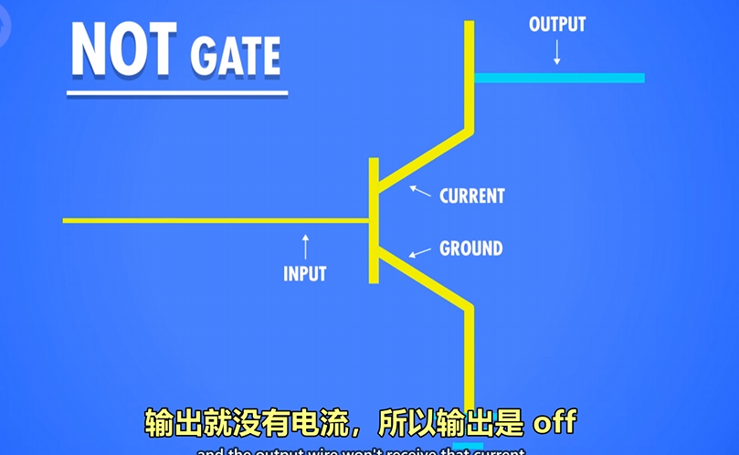

# 计算机科学基础知识
## 布尔逻辑与逻辑门  
> 布尔逻辑由 19 世纪数学家乔治・布尔（George Boole） 提出，它是一种描述 “真”（True）与 “假”（False）关系的数学体系。在数字系统中，通常用1表示 “真”，0表示 “假”，因此布尔逻辑也被称为 “二进制逻辑”。

这是计算机实现二进制计算的物理层面的基础，而这种计算也经历了从继电器、真空管、晶体管的迭代。  
### 逻辑门的硬件基础
#### 晶体管  
晶体管是如何实现二进制的呢？晶体管在 “导通”（低电阻）和 “截止”（高电阻）两种状态间切换，对应数字电路中的 “1” 和 “0”。（相当于电子开关）

* 与门

* 或门

* 非门

下方接地，上方输出接高电平，如果导通则为0，不导通则为1

* 异或门

